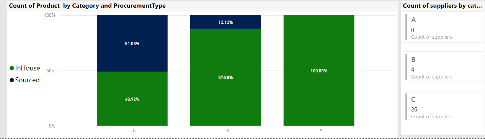

# ABC Analysis on the Adventure Works Dataset

Welcome to the GitHub repository for the ABC analysis of the Adventure Works dataset using SQL and Power BI. This repository contains SQL scripts and Jupyter notebooks needed to perform ABC analysis and visualize the results using Power BI.

Read the article on medium: [ABC Analysis on the Adventure Works Dataset using SQL and Power BI](https://medium.com/@anastaseleon/abc-analysis-on-the-adventure-works-dataset-using-sql-and-power-bi-6b22aeebe678)

## Overview

ABC analysis is a categorization technique based on the "Pareto Principle" (the 80/20 rule), which helps businesses prioritize resources and optimize inventory management by classifying items into three classes:
- **A items**: High-value with a low frequency of sales.
- **B items**: Moderate value with a moderate frequency of sales.
- **C items**: Low value with a high frequency of sales.

## Why ABC Analysis?

ABC analysis is crucial for inventory management, allowing companies to optimize their stock levels and improve resource allocation. By focusing on the most valuable items, businesses can reduce holding costs and increase operational efficiency.

## Methodology

The methodology for this analysis involves:
1. Data Preparation: Cleaning and preparing the Adventure Works dataset.
2. Data Classification: Classifying inventory items based on their consumption value and frequency.
3. Visualization: Using Power BI to visualize and interpret the classification results.

For a detailed step-by-step guide on the methodology, refer to the corresponding section in my [Medium article](https://medium.com/@anastaseleon/abc-analysis-on-the-adventure-works-dataset-using-sql-and-power-bi-6b22aeebe678).

## The Impact of ABC Analysis

Implementing ABC analysis can lead to significant improvements in inventory management. By identifying and focusing on 'A' items, businesses can:
- better sales and operation planning:
  Adventure works use s ABC analysis to make strategical decisions

- Optimize stock levels
- Reduce carrying costs
- Enhance decision-making processes

In my case, the classification will help in  the following projects in my portfolio. For example in [Time series forcasting](https://github.com/anastaseleon/Time-serie-forcasting/tree/main) , I was able to get a better performance when forecasting  individual ABC categories.

## Repository Structure

- **sql/**: SQL scripts used for creating views and performing the analysis.
- **notebooks/**: Jupyter notebooks demonstrating the analysis in Python.
- **Power BI Template/**: Template of the Power BI dashboards used in the analysis.

## Getting Started

### Prerequisites

- SQL Server (for running SQL scripts)
- Python 3.8 or above
- Jupyter Notebook or an equivalent IPython notebook environment
- Power BI Desktop

### Setup

1. **Download the Adventure Works Dataset**
   - Visit the official Microsoft SQL Server samples page: [SQL Server Samples](https://github.com/Microsoft/sql-server-samples)
   - Navigate to the 'datasets' section and download the Adventure Works database for your SQL Server version.

2. **Clone the Repository**
   ```bash
   git clone https://github.com/anastaseleon/ABC-Analysis-AdventureWorks.git
   cd ABC-Analysis-AdventureWorks
   ```

3. **Install Python Dependencies**
   ```bash
   pip install -r requirements.txt
   ```

4. **Set up the Database**
   - Restore the downloaded Adventure Works database into your SQL Server instance. This step may require SQL Server Management Studio or similar tools depending on your environment.

5. **Run SQL Scripts**
   - Execute the SQL scripts located in the `sql/` folder to create the necessary database views and perform the initial data analysis.

6. **Open and Run the Jupyter Notebooks**
   - Navigate to the `notebooks/` directory and open the Jupyter notebooks to follow a detailed step-by-step analysis.

## License

This project is licensed under the MIT License - see the [LICENSE.md](LICENSE) file for details.

